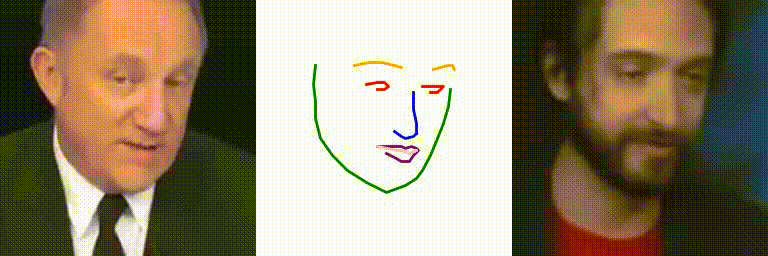

# Talking Head Models
#### основано на работе Realistic-Neural-Talking-Head-Models
Данный проект является экспериментальной реализацией идеи создания
управляемых образов человеческих лиц на основе видеорядов и фото.

Ссылка на оригианльную статью 

**Few-Shot Adversarial Learning of Realistic Neural Talking Head Models**:
 (<https://arxiv.org/pdf/1905.08233.pdf>)

Ссылка на проект, который послужил основой для текущей работы:
(<https://github.com/vincent-thevenin/Realistic-Neural-Talking-Head-Models>)

###Полученные результаты
В результате реконструкции генеративно-состязательной нейронной сети, описанной в выше указанной работе, 
а также обучения ее модели на протяжении 8 эпох, были получены результаты,
приведенные ниже.

Стоит отметить, что в дополнение к осоновному процессу обучения над моделью
производилось дообучение (FineTuning) в соответствии с рекомендациями статьи.

---
 
---
Для проверки возможности модели работать с входными образами, отличными
от тех, что использовались для обучения (человеческие лица)
было решено сформировать небольшой датасет героя фильма "Аватар",
на котором был произведен FineTuning. Результат несколько хуже, чем
те, что получены на человеческих лицах, поскольку модель "помнит" больше 
человеческих признаков, но с другой стороны, он является приемлимым и показывает
некторую универсальность применения данного алгоритма сети.
 

